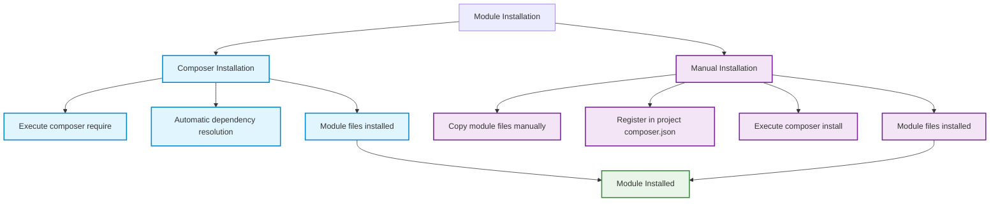

# Module Installation

This section covers the complete module installation process in OXID eShop, including different installation methods, requirements, and best practices for both production and development environments.

:::tip YouTube Tutorial
Watch a short video tutorial: [Module Installation & Configuration](https://www.youtube.com/watch?v=WGeHtJCHmyA)
:::

## Installation Methods Overview

There are **two primary ways** to install OXID eShop modules:



## Method 1: Composer Installation (Recommended)

**Best for**: Production environments, published modules, version management

### Basic Installation

```bash
# Install latest stable version
composer require vendor/module-name

# Install specific version
composer require vendor/module-name:^2.1

# Install development version
composer require vendor/module-name:dev-main
```

### Example: Installing OXID Module Template

```bash
# Install the official OXID module template
composer require oxid-esales/module-template

# Verify installation
composer show oxid-esales/module-template
```

### Advantages of Composer Installation

- ✅ **Automatic Dependency Resolution**: All required packages installed automatically
- ✅ **Version Management**: Easy updates and rollbacks
- ✅ **Clean Uninstallation**: `composer remove` cleans up completely
- ✅ **Security**: Package verification and integrity checks
- ✅ **Standard Workflow**: Industry-standard package management

### Installation Process

When you run `composer require vendor/module`:

1. **Package Download**: Composer downloads the module from the repository
2. **Dependency Check**: Verifies all required dependencies
3. **Installation**: Places files in correct location (`vendor/` or `source/modules/`)
4. **Autoload Generation**: Updates Composer autoload files
5. **Post-Install Scripts**: Runs any module-specific installation scripts

```bash
# Detailed installation with verbose output
composer require vendor/module-name -v

# Example output:
# - Installing vendor/module-name (v2.1.0): Downloading (100%)
# - Generating autoload files
# - Running post-install scripts
```

## Method 2: Manual Installation

**Best for**: Development, custom modules, modules not available via Composer

### Manual Installation Steps

#### Step 1: Obtain Module Files

```bash
# Option A: Download and extract
wget https://github.com/vendor/module/archive/main.zip
unzip main.zip

# Option B: Git clone for development
git clone https://github.com/vendor/module.git

# Option C: Copy existing module
cp -r /path/to/module ./vendor-module
```

#### Step 2: Place Module Files

```bash
# Create target directory
mkdir -p source/modules/vendor/module

# Copy module files
cp -r vendor-module/* source/modules/vendor/module/

# Verify structure
ls -la source/modules/vendor/module/
# Should show: metadata.php, composer.json, src/, etc.
```

#### Step 3: Register Module in Project

Add to your project's `composer.json`:

```json
{
    "repositories": [
        {
            "type": "path",
            "url": "source/modules/vendor/module"
        }
    ],
    "require": {
        "vendor/module": "*"
    }
}
```

#### Step 4: Install Module Dependencies

```bash
# Install module and its dependencies
composer install

# Or update existing installation
composer update vendor/module
```

### Manual Installation Example

Complete example for a custom payment module:

```bash
# 1. Create directory structure
mkdir -p source/modules/mycompany/payment

# 2. Copy module files
cp -r /development/mycompany-payment/* source/modules/mycompany/payment/

# 3. Update project composer.json
cat << 'EOF' >> composer.json
{
    "repositories": [
        {
            "type": "path", 
            "url": "source/modules/mycompany/payment"
        }
    ],
    "require": {
        "mycompany/payment": "dev-main"
    }
}
EOF

# 4. Install dependencies
composer install

# 5. Verify installation
ls -la source/modules/mycompany/payment/
composer show mycompany/payment
```

## Development Installation

### Symlink Installation (Development)

For active development, use symlinks to avoid copying files:

```bash
# 1. Create symlink to development directory
ln -s /path/to/development/module source/modules/vendor/module

# 2. Register as path repository
# (Add to composer.json as shown above)

# 3. Install in development mode
composer install --dev

# 4. Enable development dependencies
composer require --dev phpunit/phpunit
```

### Git Submodule Installation

For team development with version control:

```bash
# 1. Add module as git submodule
git submodule add https://github.com/vendor/module.git source/modules/vendor/module

# 2. Initialize submodule
git submodule init
git submodule update

# 3. Register and install
# (Add to composer.json and run composer install)
```

## Installation Requirements

### System Requirements

Before installation, verify:

```bash
# Check PHP version (minimum 8.1)
php --version

# Check required PHP extensions
php -m | grep -E "(curl|json|mbstring|openssl)"

# Check OXID eShop version
grep -r "oxid-esales/oxideshop" composer.json

# Verify file permissions
ls -la source/modules/
# Should show write permissions for web server
```

### OXID eShop Compatibility

Check module requirements against your shop:

```php
// In module's composer.json
{
    "require": {
        "php": "^8.1",
        "oxid-esales/oxideshop-ce": "^7.1",
        "oxid-esales/oxideshop-pe": "^7.1",  // If PE features needed
        "oxid-esales/oxideshop-ee": "^7.1"   // If EE features needed
    }
}
```

### Dependency Management

#### Understanding Dependencies

```bash
# View module dependencies
composer show vendor/module --tree

# Check for conflicts
composer why-not vendor/conflicting-package

# Analyze dependency graph
composer depends vendor/module
```

#### Resolving Conflicts

```bash
# Update conflicting dependencies
composer update vendor/conflicting-package

# Use specific version constraints
composer require vendor/module:~2.1.5

# Force resolution (use with caution)
composer require vendor/module --ignore-platform-reqs
```

## Platform-Specific Installation

### Linux/Unix Installation

```bash
# Set proper permissions
sudo chown -R www-data:www-data source/modules/
sudo chmod -R 755 source/modules/

# Install with proper user
sudo -u www-data composer require vendor/module

# Verify installation
sudo -u www-data ./vendor/bin/oe-console oe:module:list
```

### Windows Installation

```powershell
# Windows Command Prompt
composer require vendor/module

# PowerShell with proper execution policy
Set-ExecutionPolicy -ExecutionPolicy RemoteSigned -Scope CurrentUser
composer require vendor/module

# Git Bash (recommended)
composer require vendor/module
```

### Docker Installation

```bash
# Install in Docker container
docker-compose exec app composer require vendor/module

# Or with specific PHP version
docker run --rm -v $(pwd):/app composer:2 require vendor/module
```

## Post-Installation Verification

### File Structure Check

```bash
# Verify module files are in place
find source/modules/ -name "metadata.php" | grep vendor/module
find vendor/ -name "composer.json" | grep vendor/module

# Check autoload files
grep -r "Vendor\\\\Module" vendor/composer/autoload_psr4.php
```

### Dependency Verification

```bash
# Check all dependencies installed
composer check-platform-reqs

# Verify module appears in installed packages
composer show | grep vendor/module

# Check for security vulnerabilities
composer audit
```

### Integration Test

```php
// Quick integration test
$autoloader = require 'vendor/autoload.php';

// Test if module classes can be loaded
if (class_exists('Vendor\Module\Service\ModuleService')) {
    echo "Module classes loaded successfully\n";
} else {
    echo "Module class loading failed\n";
}
```

## Troubleshooting Installation

### Common Issues

#### 1. Permission Problems

```bash
# Fix file permissions
sudo chown -R www-data:www-data source/modules/
sudo chmod -R 755 source/modules/

# Fix Composer cache permissions
sudo chown -R $USER ~/.composer/
```

#### 2. Memory Limit Issues

```bash
# Increase PHP memory limit temporarily
php -d memory_limit=512M composer require vendor/module

# Or set permanently in php.ini
echo "memory_limit = 512M" >> /etc/php/8.1/cli/php.ini
```

#### 3. Network/Download Issues

```bash
# Use different repository
composer config repositories.packagist composer https://packagist.org

# Clear Composer cache
composer clear-cache

# Install with verbose output
composer require vendor/module -vvv
```

#### 4. Version Conflict Resolution

```bash
# Show detailed conflict information
composer why-not vendor/module

# Update dependencies to resolve conflicts
composer update --with-dependencies

# Use specific version to avoid conflicts
composer require vendor/module:~2.0.0
```

### Installation Logs

Monitor installation progress:

```bash
# Enable Composer debug logging
export COMPOSER_DEBUG=1
composer require vendor/module

# Check OXID eShop logs
tail -f source/log/oxideshop.log

# Check system logs
sudo tail -f /var/log/apache2/error.log  # Apache
sudo tail -f /var/log/nginx/error.log    # Nginx
```

## Best Practices

### 1. Pre-Installation Planning

- **📋 Review Requirements**: Check compatibility and dependencies
- **💾 Backup Database**: Create backup before installing modules
- **🧪 Test Environment**: Install in staging before production
- **📝 Document Process**: Keep installation notes for team

### 2. Installation Process

- **🔍 Verify Source**: Only install modules from trusted sources
- **🔒 Security Check**: Review module code for security issues
- **📊 Monitor Resources**: Watch memory and disk usage during installation
- **🔄 Version Pinning**: Use specific versions in production

### 3. Post-Installation

- **✅ Functionality Test**: Verify module works as expected
- **📈 Performance Check**: Monitor impact on shop performance
- **🗂️ Document Configuration**: Record settings and customizations
- **🔄 Update Process**: Plan for future module updates

## Quick Reference

### Essential Commands

```bash
# Install module
composer require vendor/module

# Install specific version
composer require vendor/module:^2.1

# Install development version
composer require vendor/module:dev-main

# Check installation
composer show vendor/module

# Update module
composer update vendor/module

# Remove module
composer remove vendor/module
```

### File Locations

- **Composer Modules**: `vendor/vendor/module/`
- **Manual Modules**: `source/modules/vendor/module/`
- **Configuration**: `composer.json`
- **Autoload**: `vendor/autoload.php`
- **Logs**: `source/log/oxideshop.log`

## Next Steps

After successful installation:

1. **[Module Configuration](configuration)**: Configure module settings
2. **[Module Setup](setup)**: Complete setup and activation
3. **[Module Activation](../../../system-architecture/module-installation-activation)**: Understand the activation process
4. **[Troubleshooting](troubleshooting)**: Resolve any issues