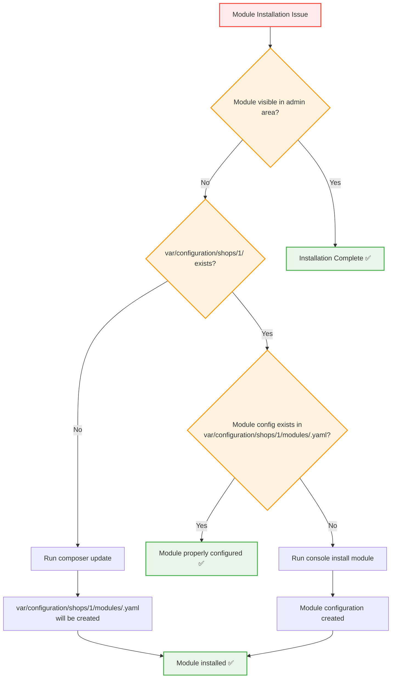

# Installation Troubleshooting

This comprehensive troubleshooting guide helps resolve common issues encountered during OXID eShop module installation, configuration, and activation. Use this guide to diagnose and fix problems efficiently.

## Quick Diagnosis

### Common Symptoms Checklist

Before diving into specific solutions, identify your issue:

- ❓ **Module not visible in admin area**
- ❓ **Composer installation fails or hangs**
- ❓ **Module shows as installed but not active**
- ❓ **Class extension conflicts**
- ❓ **Missing dependencies errors**
- ❓ **Permission denied errors**
- ❓ **Database connection issues**
- ❓ **Frontend/backend errors after activation**

## Primary Issue: Module Not Installing via Composer

### Problem Description

When using Composer to install or update a module, the module doesn't appear to be properly installed or visible in the admin area.

### Root Causes

This typically occurs in two scenarios:

1. **OXID eShop configuration files removed** from `var/configuration/shops/` directory
2. **Complete `/var` directory removed** or corrupted

### Diagnostic Flowchart



### Step-by-Step Solutions

#### Solution 1: Restore Configuration Directory

```bash
# Check if configuration directory exists
ls -la var/configuration/shops/

# If missing, run composer update to recreate
composer update

# Verify directory structure was created
find var/configuration/ -name "*.yaml" | head -5
```

#### Solution 2: Manual Module Installation

```bash
# Install module using console command
./vendor/bin/oe-console oe:module:install source/modules/vendor/module

# Alternative: Install from different path
./vendor/bin/oe-console oe:module:install /path/to/module/source

# Verify installation
./vendor/bin/oe-console oe:module:list | grep vendor-module
```

#### Solution 3: Configuration Regeneration

```bash
# Remove corrupted configuration
rm -rf var/configuration/shops/

# Regenerate configuration
composer update --no-scripts
composer install

# Reinstall modules
./vendor/bin/oe-console oe:module:install-all
```

## Common Installation Issues

### Issue 1: Permission Denied Errors

#### Symptoms:
```
Permission denied: Cannot write to var/configuration/
Failed to create directory: source/modules/vendor/module
```

#### Solution:
```bash
# Fix directory permissions
sudo chown -R www-data:www-data var/
sudo chown -R www-data:www-data source/modules/
sudo chmod -R 755 var/
sudo chmod -R 755 source/modules/

# Fix Composer cache permissions
sudo chown -R $USER ~/.composer/
chmod -R 755 ~/.composer/

# Verify permissions
ls -la var/configuration/
ls -la source/modules/
```

### Issue 2: Composer Memory Limit

#### Symptoms:
```
Fatal error: Allowed memory size exhausted
composer require vendor/module fails
```

#### Solution:
```bash
# Increase memory limit temporarily
php -d memory_limit=512M composer require vendor/module

# Increase permanently in php.ini
echo "memory_limit = 512M" | sudo tee -a /etc/php/8.1/cli/php.ini

# Alternative: Use Composer with unlimited memory
COMPOSER_MEMORY_LIMIT=-1 composer require vendor/module
```

### Issue 3: Network and Download Issues

#### Symptoms:
```
curl error: Could not resolve host
Failed to download package from repository
The "https://packagist.org" file could not be downloaded
```

#### Solution:
```bash
# Clear Composer cache
composer clear-cache

# Update Composer repositories
composer config repositories.packagist composer https://packagist.org

# Use different repository mirrors
composer config repositories.packagist composer https://repo.packagist.org

# Test network connectivity
curl -I https://packagist.org
```

### Issue 4: Dependency Conflicts

#### Symptoms:
```
Your requirements could not be resolved to an installable set of packages
Package vendor/module has requirements incompatible with your PHP version
```

#### Solution:
```bash
# Analyze dependency conflicts
composer why-not vendor/module

# Show dependency tree
composer depends vendor/conflicting-package

# Update dependencies to resolve conflicts
composer update --with-dependencies

# Install specific compatible version
composer require vendor/module:~2.1.0
```

### Issue 5: Autoloading Issues

#### Symptoms:
```
Class 'Vendor\Module\Service\MyService' not found
PSR-4 class loading failures
```

#### Solution:
```bash
# Regenerate autoload files
composer dump-autoload --optimize

# Clear all caches
rm -rf source/tmp/*

# Verify PSR-4 mapping
grep -r "Vendor\\\\Module" vendor/composer/autoload_psr4.php

# Test class loading
php -r "
require 'vendor/autoload.php';
if (class_exists('Vendor\\Module\\Service\\MyService')) {
    echo 'Class loaded successfully\n';
} else {
    echo 'Class loading failed\n';
}
"
```

## Activation Issues

### Issue 6: Module Not Appearing in Admin

#### Symptoms:
- Module installed via Composer
- Files present in `source/modules/`
- Not visible in admin Extensions → Modules

#### Diagnosis & Solution:
```bash
# Check if module is registered
./vendor/bin/oe-console oe:module:list | grep vendor-module

# Check metadata.php exists and is valid
php -l source/modules/vendor/module/metadata.php

# Manually register module
./vendor/bin/oe-console oe:module:install source/modules/vendor/module

# Clear module cache
rm -rf source/tmp/modules/
```

### Issue 7: Class Extension Conflicts

#### Symptoms:
```
Class 'ExtendedClass_parent' not found
Multiple extensions of the same class conflict
```

#### Solution:
```bash
# Check extension conflicts
./vendor/bin/oe-console oe:module:conflicts vendor-module

# View current extensions
grep -r "aModules" var/configuration/shops/1/

# Deactivate conflicting modules temporarily
./vendor/bin/oe-console oe:module:deactivate conflicting-module
./vendor/bin/oe-console oe:module:activate vendor-module

# Check extension chain order
./vendor/bin/oe-console oe:module:show vendor-module --extensions
```

### Issue 8: Database Migration Failures

#### Symptoms:
```
Migration failed to execute
Database connection error during activation
Table already exists errors
```

#### Solution:
```bash
# Check database connectivity
./vendor/bin/oe-console oe:database:test-connection

# Run migrations manually
./vendor/bin/oe-eshop-db_migrate migrations:status vendor-module
./vendor/bin/oe-eshop-db_migrate migrations:migrate vendor-module

# Check migration logs
tail -f source/log/oxideshop.log

# Rollback failed migration
./vendor/bin/oe-eshop-db_migrate migrations:execute --down Version20241122000001
```

## Configuration Issues

### Issue 9: Settings Not Saving

#### Symptoms:
- Module settings form submits but values don't persist
- Configuration changes not applied

#### Solution:
```bash
# Check file permissions for configuration
ls -la var/configuration/shops/1/modules/

# Verify settings are being written
tail -f source/log/oxideshop.log

# Clear configuration cache
rm -rf source/tmp/*

# Test programmatic setting
php -r "
require 'bootstrap.php';
use OxidEsales\EshopCommunity\Internal\Container\ContainerFacade;
\$dao = ContainerFacade::getContainer()->get('OxidEsales\\EshopCommunity\\Internal\\Framework\\Module\\Setting\\SettingDaoInterface');
\$dao->save('vendor-module', 'test_setting', 'test_value', 1);
echo 'Setting saved successfully\n';
"
```

### Issue 10: Multi-Shop Configuration Problems

#### Symptoms:
- Module works in shop 1 but not in other shops
- Different behavior across shops

#### Solution:
```bash
# Check shop-specific configuration
ls -la var/configuration/shops/*/modules/vendor-module.yaml

# Activate for specific shops
./vendor/bin/oe-console oe:module:activate vendor-module --shop-id=2
./vendor/bin/oe-console oe:module:activate vendor-module --shop-id=3

# Verify shop-specific settings
./vendor/bin/oe-console oe:module:show vendor-module --shop-id=2

# Copy configuration between shops
cp var/configuration/shops/1/modules/vendor-module.yaml \
   var/configuration/shops/2/modules/vendor-module.yaml
```

## Performance Issues

### Issue 11: Slow Module Loading

#### Symptoms:
- Increased page load times after module activation
- High memory usage

#### Diagnosis & Solution:
```bash
# Enable OXID debug mode
echo "iDebug = 1" >> source/config.inc.php

# Profile module performance
./vendor/bin/oe-console oe:module:profile vendor-module

# Check for inefficient autoloading
composer dump-autoload --optimize --classmap-authoritative

# Monitor memory usage
grep -i "memory\|fatal" source/log/oxideshop.log
```

## Development Environment Issues

### Issue 12: Module Development Setup

#### Symptoms:
- Changes not reflected immediately
- Need to constantly clear cache

#### Solution:
```bash
# Set up development mode
export OXID_DEBUG=1

# Disable template caching
echo "blTemplateCaching = false" >> source/config.inc.php

# Auto-clear cache on file changes (development)
find source/modules/vendor/module -name "*.php" | entr rm -rf source/tmp/*

# Use symlinks for active development
rm -rf source/modules/vendor/module
ln -s /path/to/development/module source/modules/vendor/module
```

## Emergency Recovery

### Complete Module Reset

When everything fails, use these nuclear options:

```bash
# 1. Complete module deactivation and cleanup
./vendor/bin/oe-console oe:module:deactivate vendor-module
rm -rf source/modules/vendor/module/
rm -f var/configuration/shops/*/modules/vendor-module.yaml
composer remove vendor/module

# 2. Clear all caches and temporary files
rm -rf source/tmp/*
rm -rf var/cache/*

# 3. Regenerate autoloads
composer dump-autoload --optimize

# 4. Fresh installation
composer require vendor/module
./vendor/bin/oe-console oe:module:activate vendor-module

# 5. Verify installation
./vendor/bin/oe-console oe:module:list
./vendor/bin/oe-console oe:module:show vendor-module
```

### Database Recovery

```sql
-- Remove module database entries
DELETE FROM oxconfig WHERE oxmodule = 'vendor-module';
DELETE FROM oxconfig WHERE oxvarname LIKE '%modules%' AND oxvarvalue LIKE '%vendor-module%';

-- Reset module extension chains
UPDATE oxconfig SET oxvarvalue = '' WHERE oxvarname = 'aModules';

-- Clear module cache
DELETE FROM oxconfig WHERE oxvarname LIKE '%module%cache%';
```

## Diagnostic Tools

### System Health Check Script

```bash
#!/bin/bash
# module-health-check.sh

MODULE_ID="$1"

echo "=== Module Health Check: $MODULE_ID ==="

# Check if module exists
if [ -d "source/modules/$MODULE_ID" ] || [ -d "vendor/${MODULE_ID//[-]//}" ]; then
    echo "✅ Module files found"
else
    echo "❌ Module files not found"
    exit 1
fi

# Check metadata
if [ -f "source/modules/$MODULE_ID/metadata.php" ]; then
    php -l "source/modules/$MODULE_ID/metadata.php"
    echo "✅ metadata.php syntax valid"
else
    echo "❌ metadata.php not found or invalid"
fi

# Check activation status
if ./vendor/bin/oe-console oe:module:list | grep -q "$MODULE_ID"; then
    echo "✅ Module registered"
else
    echo "❌ Module not registered"
fi

# Check configuration
if [ -f "var/configuration/shops/1/modules/${MODULE_ID}.yaml" ]; then
    echo "✅ Configuration file exists"
else
    echo "❌ Configuration file missing"
fi

# Check logs for errors
if grep -q "$MODULE_ID" source/log/oxideshop.log; then
    echo "⚠️  Module mentioned in logs - check for errors"
    grep "$MODULE_ID" source/log/oxideshop.log | tail -5
fi

echo "=== Health Check Complete ==="
```

### Usage:
```bash
chmod +x module-health-check.sh
./module-health-check.sh vendor-module
```

## Prevention Best Practices

### 1. Pre-Installation Checklist

- ✅ **Backup database** before installation
- ✅ **Check system requirements** and compatibility
- ✅ **Verify file permissions** are correct
- ✅ **Test in staging** environment first
- ✅ **Review module code** for security issues

### 2. Installation Best Practices

- ✅ **Use specific version** constraints in production
- ✅ **Monitor installation logs** for warnings
- ✅ **Verify functionality** immediately after installation
- ✅ **Document configuration** settings used
- ✅ **Test rollback procedure** before going live

### 3. Maintenance Practices

- ✅ **Regular updates** with testing
- ✅ **Monitor performance** impact
- ✅ **Log analysis** for issues
- ✅ **Backup configurations** before changes
- ✅ **Keep documentation** current

## Getting Help

### Log Analysis Commands

```bash
# Recent errors
tail -100 source/log/oxideshop.log | grep -i error

# Module-specific logs
grep "vendor-module" source/log/oxideshop.log

# PHP errors
tail -100 /var/log/apache2/error.log | grep PHP

# Database errors
grep -i "mysql\|database" source/log/oxideshop.log
```

### Community Resources

- **OXID Community Forum**: https://forum.oxid-esales.com
- **GitHub Issues**: Check module's GitHub repository
- **OXID Documentation**: https://docs.oxid-esales.com
- **Stack Overflow**: Tag questions with `oxid-eshop`

When reporting issues, always include:
- OXID eShop version
- PHP version
- Module version
- Error messages from logs
- Steps to reproduce

## Quick Reference

### Essential Commands
```bash
# Installation
composer require vendor/module
./vendor/bin/oe-console oe:module:install <path>
./vendor/bin/oe-console oe:module:activate <module-id>

# Diagnosis
./vendor/bin/oe-console oe:module:list
./vendor/bin/oe-console oe:module:show <module-id>
./vendor/bin/oe-console oe:module:conflicts <module-id>

# Recovery
composer clear-cache
rm -rf source/tmp/*
composer dump-autoload --optimize
```

### File Locations
- **Modules**: `source/modules/vendor/module/`
- **Configuration**: `var/configuration/shops/1/modules/module.yaml`
- **Logs**: `source/log/oxideshop.log`
- **Cache**: `source/tmp/`