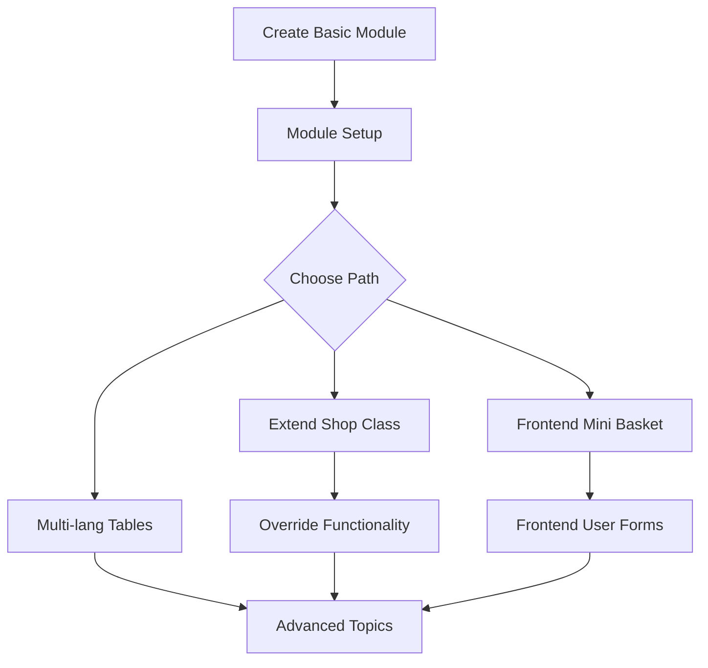

# Module Tutorials

This section provides step-by-step tutorials for common module development tasks in OXID eShop. Each tutorial builds upon previous knowledge and introduces new concepts progressively.

## Tutorial Overview

### Beginner Tutorials

Perfect for developers new to OXID module development:

#### [Create Basic Module](create-basic-module)
**Duration**: 30-45 minutes  
**Prerequisites**: Basic PHP knowledge, OXID eShop installed

Learn the fundamental steps to create your first OXID module:
- Set up the basic module structure
- Create metadata.php configuration
- Write your first controller
- Test the module in the shop

#### [Module Setup for Development](module-setup)
**Duration**: 15-20 minutes  
**Prerequisites**: Existing module or completed basic module tutorial

Configure your development environment for efficient module development:
- Best practice module setup with Composer
- Register module package paths  
- Handle module dependencies with other libraries

### Intermediate Tutorials

For developers ready to tackle more complex scenarios:

#### [Extend Shop Class](extend-shop-class)
**Duration**: 45-60 minutes  
**Prerequisites**: Understanding of OXID's class structure

Learn how to extend existing OXID functionality:
- Override existing shop classes
- Implement the chain extension pattern
- Work with OXID's unified namespace system
- Handle multiple module extensions

#### [Override Functionality](override-functionality)
**Duration**: 30-45 minutes  
**Prerequisites**: Basic module knowledge

Master the art of safely overriding OXID functionality:
- Identify extension points
- Implement custom business logic
- Maintain compatibility with other modules
- Test overridden functionality

### Frontend Development Tutorials

Focus on user-facing module features:

#### [Frontend Mini Basket](frontend-mini-basket)
**Duration**: 60-90 minutes  
**Prerequisites**: Basic module knowledge, HTML/CSS skills

Create a custom mini-basket component:
- Develop custom frontend controllers
- Work with OXID templates
- Implement AJAX functionality
- Style with CSS

#### [Frontend User Forms](frontend-user-forms)
**Duration**: 45-60 minutes  
**Prerequisites**: Frontend development basics

Build custom user interaction forms:
- Create form controllers and validation
- Handle form submissions securely
- Integrate with OXID's user system
- Provide user feedback

### Database and Backend Tutorials

Work with data and backend functionality:

#### [Multi-language and Shop Tables](multi-lang-and-shop-tables)
**Duration**: 60-75 minutes  
**Prerequisites**: Database knowledge, understanding of OXID's multi-shop concept

Handle complex data scenarios:
- Work with OXID's multi-language system
- Implement multi-shop compatibility
- Create custom database tables
- Handle data migrations

## Tutorial Structure

Each tutorial follows a consistent structure for easy learning:

### 1. Learning Objectives
Clear goals for what you'll accomplish in the tutorial.

### 2. Prerequisites  
Required knowledge and setup before starting.

### 3. Step-by-Step Instructions
Detailed, numbered steps with code examples.

### 4. Code Examples
Complete, working code that you can copy and modify.

### 5. Testing Instructions
How to verify that your implementation works correctly.

### 6. Common Issues
Troubleshooting guide for typical problems.

### 7. Next Steps
Suggestions for extending or building upon the tutorial.

## Before You Start

### Development Environment Setup

Ensure you have the following set up before beginning any tutorial:

1. **OXID eShop Installation**: Working development installation
2. **IDE Configuration**: [Properly configured IDE](../../../getting-started/ide/)
3. **Version Control**: Git repository for your module
4. **Testing Environment**: Separate test database and configuration

### Recommended Learning Path

For optimal learning, follow tutorials in this order:

### Module Template

All tutorials use the [official OXID module template](https://github.com/OXID-eSales/module-template) as a starting point. This template provides:

- Standard directory structure
- Pre-configured metadata.php
- Composer.json setup
- Basic testing structure
- Documentation templates

## Tutorial Best Practices

### Code Quality
- All tutorial code follows [PSR-12 standards](../../../getting-started/ide/phpstorm/codingstyle)
- Examples include proper error handling
- Code is documented with clear comments

### Real-World Relevance
- Tutorials solve actual development challenges
- Examples can be adapted for production use
- Best practices are demonstrated throughout

### Testing Focus
- Each tutorial includes testing instructions
- Unit tests are provided where applicable
- Integration testing is covered

## Getting Help

If you encounter issues while following tutorials:

### Documentation Resources
1. **Check Prerequisites**: Ensure you meet all requirements
2. **Review Code Carefully**: Compare your code with tutorial examples
3. **Check Error Logs**: Look for specific error messages
4. **Test Step by Step**: Verify each step before proceeding

### Community Support
1. **[OXID Forum](https://forum.oxid-esales.com)**: Ask questions and get help
2. **[GitHub Issues](https://github.com/OXID-eSales/developer_documentation/issues)**: Report tutorial problems
3. **[Stack Overflow](https://stackoverflow.com/questions/tagged/oxid-esales)**: Search existing solutions

### Additional Resources
- **[Module Development Guide](../index)**: Complete module development reference
- **[System Architecture](../../../system-architecture/)**: Understand OXID's internals
- **[Testing Documentation](../../testing/)**: Comprehensive testing guidance

## Contributing to Tutorials

Help improve these tutorials by:

1. **Testing Instructions**: Verify tutorials work with current OXID versions
2. **Suggesting Improvements**: Propose clearer explanations or better examples
3. **Adding New Tutorials**: Contribute tutorials for common development scenarios
4. **Reporting Issues**: Let us know about outdated or incorrect information

See our [contribution guidelines](../../../conventions) for more information.

## Advanced Learning

After completing these tutorials, consider exploring:

### Advanced Topics
- **[Service Container Integration](../../tell-me-about/service-container)**
- **[Event System Usage](../../tell-me-about/event/)**  
- **[Console Command Development](../../tell-me-about/console)**
- **[Module Certification](../certification/)**

### Specialized Areas
- **Payment Module Development**
- **Shipping Provider Integration**
- **ERP System Connections**
- **Third-party API Integration**

### Community Projects
- **Open Source Modules**: Contribute to community modules
- **Module Reviews**: Help review and improve existing modules
- **Documentation**: Help maintain and improve OXID documentation

---

Ready to start? Begin with **[Create Basic Module](create-basic-module)** to build your first OXID eShop module!