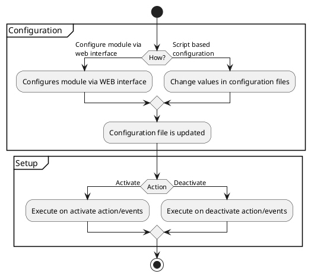

# Modules configuration and setup

:::note
Watch a short video tutorial on YouTube: [Module Installation & Configuration](https://www.youtube.com/watch?v=WGeHtJCHmyA).
:::

## Overview

In most cases modules need to be configured before you can proceed with setup and activate it. There
are two ways of configuring modules:

1. [Configuring modules via admin interface](#configuring-modules-via-admin-interface)

2. The automatic deployment friendly way
   by [Configuring modules via providing configuration files](#configuring-modules-via-providing-configuration-files)



## Configuration

### Configuring modules via admin interface

To configure modules via admin interface, open OXID eShop administration panel
and go to **Extensions** → **Modules**.

You will see a list of installed modules.

Select the module you want to configure and choose **Settings**.

You will see a list of settings that you can change.

Entries in the settings list are loaded and saved in configuration files located in `var/configuration/shops`.

For each shop ID there is one directory with the complete configuration for this shop.

So if the shop has ID 1, a directory would be named 1. See the example below:

```
.
└── var
    └── configuration
        └── shops
            └── 1
            └── 2
            └── ...
```

:::note
If the `var` directory cannot be found in the project directory, execute `composer update` or create the `var` directory manually.

Also, each shop must have their own separate directory.
:::

### Configuring modules via providing configuration files

Since the complete configuration is in configuration files, you can make it part of the
VCS repository of your project and deploy it to your testing, staging and productive
systems and deploy through the command line as described below in the
section [deploy module configurations](#deploying-module-configurations).

Project configuration files are located in project directory `var/configuration/shops/<shop-id>/`, where "`<shop-id>`" represents
sub-shop ID. In case you don't use sub-shop functionality, it will always be only one directory.

Each directory with a shop configuration has a `class_extension_chain.yaml` file with the module class extension chains
and a separate subdirectory `modules` for module configurations. Configuration for every module is in a separate file
where filename is the module id: `var/configuration/shops/<shop-id>/modules/<module-id>.yaml`

```
.
└── var
    └── configuration
        └── shops
            └── 1
                └── modules
                    └── oe_moduletemplate.yaml
                    └── ...
                └── class_extension_chain.yaml
```

#### Configuration files

These files contain information of all modules which are [installed](../../module/installation-setup/installation.md).

During the installation process, all of the information from module `metadata.php` is being transferred to the
configuration files.

For example you have OXID eShop without any modules, so `var/configuration/shops/<shop-id>/modules/` will be empty.

When you will run the installation let's say for the OXID eShop Module Template module, the files in `var/configuration/shops/<shop-id>/` will be filled with information from `metadata.php`.

An example of stripped down configuration file `var/configuration/shops/1/modules/oe_moduletemplate.yaml`:

```yaml
id: oe_moduletemplate
moduleSource: vendor/oxid-esales/module-template
version: 2.0.0
activated: true
title:
  en: 'OxidEsales Module Template (OEMT)'
description:
  en: ''
lang: ''
thumbnail: pictures/logo.png
author: 'OXID eSales AG'
url: ''
email: ''
classExtensions:
  OxidEsales\Eshop\Application\Model\User: OxidEsales\ModuleTemplate\Model\User
  OxidEsales\Eshop\Application\Controller\StartController: OxidEsales\ModuleTemplate\Controller\StartController
controllers:
  oemtgreeting: OxidEsales\ModuleTemplate\Controller\GreetingController
events:
  onActivate: '\OxidEsales\ModuleTemplate\Core\ModuleEvents::onActivate'
  onDeactivate: '\OxidEsales\ModuleTemplate\Core\ModuleEvents::onDeactivate'
moduleSettings:
  oemoduletemplate_GreetingMode:
    group: oemoduletemplate_main
    type: select
    value: generic
    constraints:
      - generic
      - personal
  oemoduletemplate_BrandName:
    group: oemoduletemplate_main
    type: str
    value: Testshop
```

Also, the file with the module class extension chain will be generated.

Example: `var/configuration/shops/1/class_extension_chain.yaml`:

```yaml
OxidEsales\Eshop\Application\Model\User:
    - OxidEsales\ModuleTemplate\Model\User
```