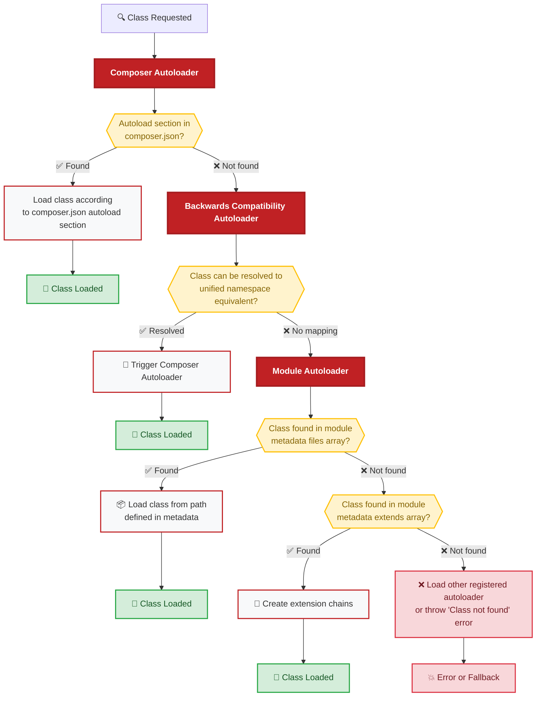

# Autoloading of Classes

OXID eShop uses a sophisticated multi-tier autoloading system to efficiently load classes from different sources. The shop has three autoloaders registered in a specific order: **Composer Autoloader**, **Backwards Compatibility Autoloader**, and **Module Autoloader**. They are registered in exactly this order in the `bootstrap.php` file.

## General Workflow

When you request a class, the system follows this workflow:



The autoloaders are tried in sequence until one successfully loads the requested class.

## 1. Composer Autoloader

The **Composer Autoloader** is the first autoloader in the chain and handles all namespaced classes configured in the root `composer.json` file or child `composer.json` files.

### Characteristics:
- **Priority**: First in chain (highest priority)
- **Scope**: All namespaced classes defined in `composer.json` autoload sections
- **Performance**: Fastest resolution using Composer's optimized class maps

### Example Classes Handled:
- `OxidEsales\Eshop\Application\Model\Article`
- `OxidEsales\EshopCommunity\Application\Controller\StartController`
- `Vendor\ModuleName\Application\Model\CustomClass`

### Configuration Example:
```json
{
  "autoload": {
    "psr-4": {
      "OxidEsales\\Eshop\\": "source/",
      "MyVendor\\MyModule\\": "modules/myvendor/mymodule/src/"
    }
  }
}
```

## 2. Backwards Compatibility Autoloader

The **Backwards Compatibility Autoloader** maintains compatibility with legacy class names by mapping them to their unified namespace equivalents.

### Purpose:
- Autoload deprecated shop classes defined in `Core/Autoload/BackwardsCompatibilityAutoload.php`
- **Not a real autoloader** - acts as a translation layer
- Enables legacy code to work without modification

### How It Works:

1. **Legacy class requested** (e.g., `oxArticle`)
2. **Searches for unified namespace equivalent** in the backwards compatibility map
3. **Resolves to unified namespace class** (`OxidEsales\Eshop\Application\Model\Article`)
4. **Hands request to Composer autoloader** for final loading

### Example Mapping:
```php
// When you request this legacy class:
$article = oxNew('oxArticle');

// The autoloader resolves it to:
$article = oxNew(OxidEsales\Eshop\Application\Model\Article::class);
```

### Legacy Class Examples:
- `oxArticle` → `OxidEsales\Eshop\Application\Model\Article`
- `oxUser` → `OxidEsales\Eshop\Application\Model\User`
- `oxConfig` → `OxidEsales\Eshop\Core\Config`

## 3. Module Autoloader

The **Module Autoloader** is responsible for loading module classes that are defined in module metadata files.

### Primary Functions:

1. **Module File Classes**: Loads classes defined in the `files` array of module metadata
2. **Extension Chains**: Creates extension chains for classes defined in the `extend` array
3. **Dynamic Class Creation**: Handles classes that need to be created at runtime

### Loading Process:

#### Step 1: Module Files Check
- Checks if the requested class exists in any active module's `files` array
- If found, includes the class file directly
- Process stops here if successful

#### Step 2: Extension Chain Creation
- If not found in files, checks the `extend` array
- Creates extension chains for module classes that extend other classes
- Handles cases where extensions are created via `new ExtendedClass` instead of `oxNew`
- Creates missing parent classes (like `ExtendedClass_parent`) dynamically

### Module Metadata Example:
```php
// metadata.php in a module
$aModule = [
    'id' => 'mymodule',
    'files' => [
        'MyModule\\Application\\Model\\CustomClass' => 'mymodule/Application/Model/CustomClass.php'
    ],
    'extend' => [
        'OxidEsales\\Eshop\\Application\\Model\\Article' => 'MyModule\\Application\\Model\\Article'
    ]
];
```

## Performance Considerations

### Autoloader Order Impact
The order of autoloaders affects performance:

1. **Composer** (fastest) - Uses optimized class maps
2. **Backwards Compatibility** (medium) - Simple lookup + delegation  
3. **Module** (slowest) - Complex logic for extension chains

### Optimization Tips:
- **Use unified namespace classes** instead of legacy names when possible
- **Optimize Composer autoload** with `composer dump-autoload --optimize`
- **Minimize module extensions** to reduce Module Autoloader overhead
- **Use `composer dump-autoload --classmap-authoritative`** in production

## Common Issues and Troubleshooting

### Class Not Found Errors

If you encounter class loading issues:

1. **Check autoload configuration** in `composer.json`
2. **Regenerate Composer autoload** with `composer dump-autoload`
3. **Verify module metadata** for correct class paths
4. **Ensure unified namespace classes** are generated correctly

### Composer Remove Issues

:::warning Composer Remove Command
When running `composer remove <package>` in OXID eShop, Composer might fail with "class not found" errors due to autoloader state issues.

**Solution**: Add this configuration to your root `composer.json`:

```json
{
  "config": {
    "prepend-autoloader": false
  }
}
```
:::

### Debugging Autoloader Issues

To debug autoloading problems:

1. **Check registered autoloaders**:
   ```php
   var_dump(spl_autoload_functions());
   ```

2. **Test class resolution manually**:
   ```php
   if (class_exists('OxidEsales\\Eshop\\Application\\Model\\Article')) {
       echo "Class found by autoloaders";
   }
   ```

3. **Verify file paths** in module metadata and Composer configuration

## Best Practices

### For Core Development
- Always use **unified namespace classes** in new code
- Maintain **backwards compatibility mappings** for legacy support
- **Optimize Composer autoload** configuration for performance

### For Module Development
- Use **PSR-4 autoloading** in your module's `composer.json`
- **Minimize extends array usage** - prefer composition over inheritance
- **Test autoloading** in different shop editions (CE/PE/EE)

### For Production
- Run `composer dump-autoload --optimize --classmap-authoritative`
- Enable **OPcache** for better autoloading performance
- **Monitor autoloader performance** in application profiling

## Related Topics

- **[Unified Namespace](unified-namespace/)**: Understanding the classes loaded by the Composer autoloader
- **[Module Development](/docs/development/modules-components-themes/module/)**: How to configure autoloading in modules
- **[Module Installation & Activation](module-installation-activation)**: How the Module Autoloader integrates with module lifecycle