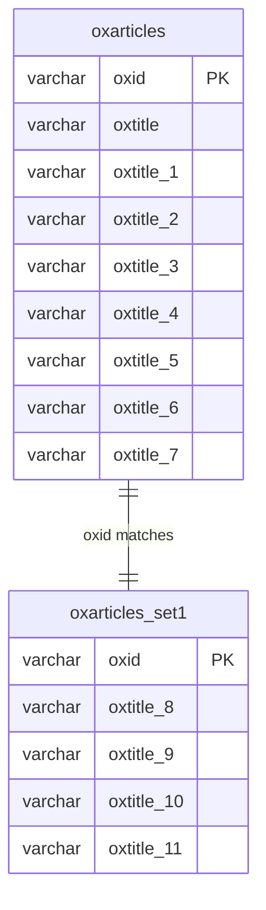

# Multilingual System Architecture

OXID eShop provides comprehensive multilingual support through a sophisticated database architecture that allows efficient storage, retrieval, and management of content in multiple languages. This system is fundamental to OXID's internationalization capabilities.

## Overview

The multilingual system enables:

- **Dynamic Language Support**: Add and remove languages without code changes
- **Efficient Data Storage**: Optimized database structure for multilingual content
- **Automatic View Generation**: Database views for seamless language-specific data access
- **Scalable Architecture**: Support for unlimited languages with performance optimization
- **Multi-Shop Language Management**: Different language configurations per shop

## Database Architecture

### Multilingual Field Structure

OXID eShop implements multilingual support by extending database tables with language-specific columns. Not all fields are translatable - only designated multilingual fields support multiple languages.

#### Example: Article Title Translation

```sql
-- Base table: oxarticles
CREATE TABLE oxarticles (
    OXID        VARCHAR(32),
    oxtitle     VARCHAR(255),    -- Language 0 (base language)
    oxtitle_1   VARCHAR(255),    -- Language 1
    oxtitle_2   VARCHAR(255),    -- Language 2
    oxtitle_3   VARCHAR(255),    -- Language 3
    -- ... additional multilingual fields
);
```

### Language ID Mapping

Each language is assigned a numeric identifier:

| Language ID | Storage Location | Example |
|-------------|------------------|---------|
| **0** | `oxtitle` | German (base language) |
| **1** | `oxtitle_1` | English |
| **2** | `oxtitle_2` | French |
| **3** | `oxtitle_3` | Spanish |
| **4** | `oxtitle_4` | Italian |
| **...** | `oxtitle_n` | Additional languages |

:::info Default Language Columns
OXID eShop includes default columns for up to **8 languages** (IDs 0-7) in core tables. This provides optimal performance for most multilingual scenarios without requiring database modifications.
:::

### Dynamic Column Creation

For languages beyond the default columns, OXID automatically extends the database:

```sql
-- Language 5 (beyond default) - adds new column
ALTER TABLE oxarticles ADD COLUMN oxtitle_5 VARCHAR(255);

-- Language 6
ALTER TABLE oxarticles ADD COLUMN oxtitle_6 VARCHAR(255);

-- Language 7  
ALTER TABLE oxarticles ADD COLUMN oxtitle_7 VARCHAR(255);
```

### Extension Tables for High Language Counts

When the number of languages reaches **8 or more** (language ID 8+), OXID creates extension tables:

#### Extension Table Architecture:



#### Extension Table Naming Pattern:

```sql
-- First extension table (languages 8-15)
CREATE TABLE oxarticles_set1 (
    OXID         VARCHAR(32) PRIMARY KEY,
    oxtitle_8    VARCHAR(255),    -- Language 8
    oxtitle_9    VARCHAR(255),    -- Language 9
    -- ... up to oxtitle_15
);

-- Second extension table (languages 16-23)  
CREATE TABLE oxarticles_set2 (
    OXID         VARCHAR(32) PRIMARY KEY,
    oxtitle_16   VARCHAR(255),    -- Language 16
    oxtitle_17   VARCHAR(255),    -- Language 17
    -- ... up to oxtitle_23
);
```

### Extension Table Relationship

```php
<?php
// Extension table relationship example
$articleId = 'b56369b64628a3c04cad5f15d22df';

// Base table data (languages 0-7)
SELECT oxtitle, oxtitle_1, oxtitle_2 
FROM oxarticles 
WHERE oxid = '$articleId';

// Extension table data (languages 8+)
SELECT oxtitle_8, oxtitle_9 
FROM oxarticles_set1 
WHERE oxid = '$articleId';
```

:::warning Extension Table Behavior
If no data exists for a language in extension tables (ID ≥8), there is **no entry** in the extension table for that record. Database views will return `NULL` for these fields, not empty strings.
:::

## Database Views for Language Access

### Automatic View Generation

OXID generates database views to provide seamless access to language-specific data:

#### View Naming Convention:

```
oxv_{table_name}_{shop_id}_{language_code}
```

#### Example Views:

```sql
-- German articles view for shop 1
CREATE VIEW oxv_oxarticles_1_de AS 
SELECT 
    oxid,
    oxtitle,           -- German title (language 0)
    oxprice,
    oxactive
FROM oxarticles;

-- English articles view for shop 1  
CREATE VIEW oxv_oxarticles_1_en AS
SELECT 
    oxid,
    oxtitle_1 AS oxtitle,  -- English title (language 1)
    oxprice,
    oxactive  
FROM oxarticles;

-- French articles view for shop 1
CREATE VIEW oxv_oxarticles_1_fr AS
SELECT 
    oxid,
    oxtitle_2 AS oxtitle,  -- French title (language 2)
    oxprice,
    oxactive
FROM oxarticles;
```

### Complex View Generation with Extension Tables

For languages using extension tables:

```sql
-- Language 8 (German) view with extension table
CREATE VIEW oxv_oxarticles_1_de_8 AS
SELECT 
    a.oxid,
    COALESCE(ext.oxtitle_8, a.oxtitle) AS oxtitle,  -- Fallback to base language
    a.oxprice,
    a.oxactive
FROM oxarticles a
LEFT JOIN oxarticles_set1 ext ON a.oxid = ext.oxid;
```

### View Regeneration Process

Views must be regenerated when:
- **New languages are added**
- **Languages are removed** 
- **Shop configuration changes**
- **Database schema modifications**

```bash
# Regenerate all database views
./vendor/bin/oe-eshop-db_views_generate

# Regenerate views for specific shop
./vendor/bin/oe-eshop-db_views_generate --shop-id=1

# Force regeneration (removes and recreates all views)
./vendor/bin/oe-eshop-db_views_generate --force
```

:::warning View Generation Timing
When creating multiple languages in sequence, views are only available after explicit regeneration. The **last added language** will not have functional views until regeneration is complete.
:::

## Language Data Access in Code

### Automatic Language Resolution

OXID's object model automatically resolves the correct language data:

```php
<?php
use OxidEsales\Eshop\Application\Model\Article;
use OxidEsales\Eshop\Core\Registry;

// Set active language (e.g., English - language ID 1)
Registry::getLang()->setBaseLanguage(1);

// Load article - automatically uses English data
$article = oxNew(Article::class);
$article->load('b56369b64628a3c04cad5f15d22df');

// This returns English title from oxtitle_1 column
$englishTitle = $article->oxarticles__oxtitle->value;

echo "Article title: " . $englishTitle;
```

### Multi-Shop Language Access

In Enterprise Edition with multiple shops:

```php
<?php
use OxidEsales\Eshop\Application\Model\Article;
use OxidEsales\Eshop\Core\Registry;

// Set shop context (shop ID 1)
$config = Registry::getConfig();
$config->setShopId(1);

// Set language (French - language ID 2)  
Registry::getLang()->setBaseLanguage(2);

// Article object automatically loads from oxv_oxarticles_1_fr view
$article = oxNew(Article::class);
$article->load('article-id');

// Returns French title
$frenchTitle = $article->oxarticles__oxtitle->value;
```

### Direct Database Access

For advanced scenarios, direct view access:

```php
<?php
use OxidEsales\Eshop\Core\DatabaseProvider;

$db = DatabaseProvider::getDb();

// Query specific language view directly
$sql = "SELECT oxtitle, oxprice FROM oxv_oxarticles_1_de WHERE oxactive = 1 LIMIT 10";
$result = $db->select($sql);

while (!$result->EOF) {
    echo "German Title: " . $result->fields['oxtitle'] . "\n";
    echo "Price: " . $result->fields['oxprice'] . "\n";
    $result->moveNext();
}
```

## Language Configuration Management

### Adding New Languages

#### Step 1: Configure Language in Admin

```
Admin Panel → Master Settings → Languages
├── Add New Language
│   ├── Language Abbreviation: "it" (Italian)
│   ├── Sort Order: 4
│   └── Active: Yes
└── Save Configuration
```

#### Step 2: Database Schema Update

OXID automatically:
1. **Adds columns** for new language (if needed)
2. **Creates extension tables** (if language ID ≥ 8)
3. **Updates language configuration**

#### Step 3: Regenerate Database Views

```bash
# Essential after adding languages
./vendor/bin/oe-eshop-db_views_generate

# Verify view creation
mysql -u[user] -p[pass] [database] -e "SHOW TABLES LIKE 'oxv_%_it';"
```

### Language Configuration Verification

```bash
# Check active languages
./vendor/bin/oe-console oe:language:list

# Verify language-specific views exist
mysql -u[user] -p[pass] [database] -e "
SELECT TABLE_NAME 
FROM information_schema.TABLES 
WHERE TABLE_NAME LIKE 'oxv_oxarticles_%' 
ORDER BY TABLE_NAME;
"

# Check extension tables
mysql -u[user] -p[pass] [database] -e "SHOW TABLES LIKE '%_set%';"
```

## Performance Considerations

### Optimal Language Architecture

#### Small to Medium Sites (≤ 4 Languages):
- **Use default columns** (optimal performance)
- **No extension tables** needed
- **Direct column access** in views

#### Large Multilingual Sites (5-7 Languages):
- **Dynamic columns** added automatically  
- **Single table architecture** maintained
- **Good performance** with proper indexing

#### Enterprise Multilingual (8+ Languages):
- **Extension tables** for languages 8+
- **LEFT JOIN operations** in views
- **Index optimization** crucial for performance

### Performance Optimization

#### Database Indexing:

```sql
-- Optimize multilingual queries
CREATE INDEX idx_oxtitle_lang ON oxarticles(oxtitle);
CREATE INDEX idx_oxtitle_1_lang ON oxarticles(oxtitle_1);
CREATE INDEX idx_oxtitle_2_lang ON oxarticles(oxtitle_2);

-- Extension table indexes
CREATE INDEX idx_ext_oxtitle_8 ON oxarticles_set1(oxtitle_8);
CREATE INDEX idx_ext_oxid ON oxarticles_set1(oxid);
```

#### Query Optimization:

```php
<?php
// Efficient: Use views for language-specific queries
$sql = "SELECT oxtitle, oxprice FROM oxv_oxarticles_1_de WHERE oxactive = 1";

// Inefficient: Manual language column selection
$sql = "SELECT 
    CASE 
        WHEN :lang = 0 THEN oxtitle
        WHEN :lang = 1 THEN oxtitle_1  
        WHEN :lang = 2 THEN oxtitle_2
    END as title
FROM oxarticles";
```

#### Caching Strategies:

```php
<?php
// Cache multilingual data efficiently
$cacheKey = "article_title_{$articleId}_{$languageId}_{$shopId}";

if (!$title = $cache->get($cacheKey)) {
    $article = oxNew(Article::class);
    $article->load($articleId);
    $title = $article->oxarticles__oxtitle->value;
    
    $cache->set($cacheKey, $title, 3600); // 1 hour cache
}
```

## Common Issues & Troubleshooting

### Issue 1: Missing Language Data

**Symptoms:**
- Empty titles in frontend
- NULL values in database queries
- Missing content for specific languages

**Solution:**
```bash
# Check if views exist for the language
mysql -u[user] -p[pass] [database] -e "SHOW TABLES LIKE 'oxv_oxarticles_%';"

# Regenerate views
./vendor/bin/oe-eshop-db_views_generate

# Check extension table data
mysql -u[user] -p[pass] [database] -e "SELECT COUNT(*) FROM oxarticles_set1;"
```

### Issue 2: View Generation Problems

**Symptoms:**
- Shop goes offline after adding languages
- Database errors in logs
- Incorrect language data displayed

**Solution:**
```bash
# Force complete view regeneration
./vendor/bin/oe-eshop-db_views_generate --force

# Check for view errors
mysql -u[user] -p[pass] [database] -e "
SELECT TABLE_NAME, TABLE_COMMENT 
FROM information_schema.TABLES 
WHERE TABLE_TYPE = 'VIEW' AND TABLE_SCHEMA = '[database]'
ORDER BY TABLE_NAME;
"

# Verify view syntax
mysql -u[user] -p[pass] [database] -e "SHOW CREATE VIEW oxv_oxarticles_1_de;"
```

### Issue 3: Extension Table Performance

**Symptoms:**
- Slow queries for languages 8+
- High database load
- Timeout errors

**Solution:**
```sql
-- Add proper indexes to extension tables
CREATE INDEX idx_oxarticles_set1_oxid ON oxarticles_set1(oxid);
CREATE INDEX idx_oxarticles_set1_title ON oxarticles_set1(oxtitle_8);

-- Analyze query performance
EXPLAIN SELECT * FROM oxv_oxarticles_1_de_8 WHERE oxtitle LIKE '%product%';

-- Optimize extension table queries
OPTIMIZE TABLE oxarticles_set1;
```

## Development Best Practices

### Language-Aware Development

#### 1. Always Use Views

```php
<?php
// ✅ Correct: Use language-aware model loading
$article = oxNew(Article::class);
$article->load($articleId);  // Automatically uses correct language view
$title = $article->oxarticles__oxtitle->value;

// ❌ Incorrect: Direct table access ignores language context
$db = DatabaseProvider::getDb();
$title = $db->getOne("SELECT oxtitle FROM oxarticles WHERE oxid = ?", [$articleId]);
```

#### 2. Language Fallback Strategy

```php
<?php
use OxidEsales\Eshop\Core\Registry;

class LanguageHelper 
{
    public function getLocalizedField($object, $fieldName, $fallbackToBase = true) 
    {
        $value = $object->{$object->getCoreTableName() . '__' . $fieldName}->value;
        
        if (empty($value) && $fallbackToBase) {
            // Fallback to base language (ID 0)
            $currentLang = Registry::getLang()->getBaseLanguage();
            Registry::getLang()->setBaseLanguage(0);
            
            $object->load($object->getId());
            $value = $object->{$object->getCoreTableName() . '__' . $fieldName}->value;
            
            Registry::getLang()->setBaseLanguage($currentLang);
        }
        
        return $value;
    }
}
```

#### 3. Efficient Language Switching

```php
<?php
use OxidEsales\Eshop\Core\Registry;

class MultilingualController 
{
    public function getProductTitlesAllLanguages($productId) 
    {
        $titles = [];
        $languages = Registry::getLang()->getLanguageIds();
        $currentLang = Registry::getLang()->getBaseLanguage();
        
        foreach ($languages as $langId => $langCode) {
            Registry::getLang()->setBaseLanguage($langId);
            
            $article = oxNew(Article::class);
            $article->load($productId);
            $titles[$langCode] = $article->oxarticles__oxtitle->value;
        }
        
        // Restore original language
        Registry::getLang()->setBaseLanguage($currentLang);
        
        return $titles;
    }
}
```

## Advanced Language Management

### Programmatic Language Administration

```php
<?php
use OxidEsales\Eshop\Core\Registry;
use OxidEsales\Eshop\Core\DbMetaDataHandler;

class LanguageManager 
{
    public function addLanguage($languageCode, $languageName, $sort = 99) 
    {
        $config = Registry::getConfig();
        $languages = $config->getConfigParam('aLanguages');
        
        // Add new language to configuration
        $newLangId = max(array_keys($languages)) + 1;
        $languages[$newLangId] = $languageCode;
        
        $config->setConfigParam('aLanguages', $languages);
        
        // Update language names
        $languageNames = $config->getConfigParam('aLanguageParams');
        $languageNames[$languageCode] = [
            'baseId' => $newLangId,
            'active' => 1,
            'sort' => $sort,
            'name' => $languageName
        ];
        
        $config->setConfigParam('aLanguageParams', $languageNames);
        
        // Update database schema
        $metaDataHandler = oxNew(DbMetaDataHandler::class);
        $metaDataHandler->updateViews();
        
        return $newLangId;
    }
}
```

### Language Data Migration

```php
<?php
class LanguageDataMigration 
{
    public function migrateLanguageData($sourceField, $targetLangId) 
    {
        $db = DatabaseProvider::getDb();
        
        // Get target column name
        $targetField = $sourceField . ($targetLangId > 0 ? '_' . $targetLangId : '');
        
        // Migrate article titles
        $sql = "UPDATE oxarticles SET {$targetField} = {$sourceField} WHERE {$targetField} IS NULL AND {$sourceField} IS NOT NULL";
        $db->execute($sql);
        
        // Handle extension tables for languages 8+
        if ($targetLangId >= 8) {
            $setTable = 'oxarticles_set' . floor($targetLangId / 8);
            $sql = "
                INSERT INTO {$setTable} (oxid, {$targetField}) 
                SELECT oxid, {$sourceField} 
                FROM oxarticles 
                WHERE {$sourceField} IS NOT NULL
                ON DUPLICATE KEY UPDATE {$targetField} = VALUES({$targetField})
            ";
            $db->execute($sql);
        }
    }
}
```

## Integration with Multi-Shop

### Shop-Specific Language Configuration

In OXID Enterprise Edition, each shop can have different language configurations:

```php
<?php
// Configure languages per shop
$shopConfig = [
    1 => ['de', 'en'],           // Shop 1: German + English
    2 => ['en', 'fr', 'es'],     // Shop 2: English + French + Spanish  
    3 => ['de', 'it', 'fr'],     // Shop 3: German + Italian + French
];

foreach ($shopConfig as $shopId => $languages) {
    Registry::getConfig()->setShopId($shopId);
    
    foreach ($languages as $index => $langCode) {
        // Configure language for specific shop
        $this->configureShopLanguage($shopId, $index, $langCode);
    }
}
```

The multilingual system is a core strength of OXID eShop, enabling sophisticated international e-commerce operations. Understanding its architecture is essential for developing robust multilingual applications and maintaining optimal performance across all supported languages.