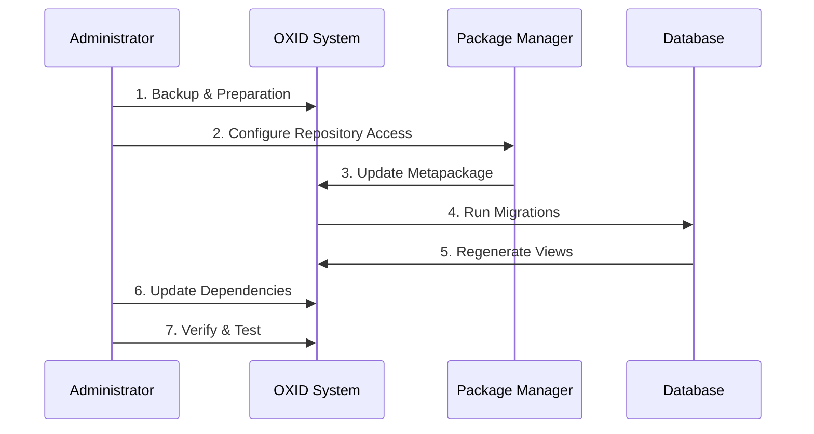

# Edition Upgrades

This section covers upgrading between different OXID eShop editions: Community Edition (CE), Professional Edition (PE), and Enterprise Edition (EE). Edition upgrades involve significant architectural changes and require careful planning and execution.

## Edition Overview

### OXID eShop Editions Comparison

| Feature | Community Edition (CE) | Professional Edition (PE) | Enterprise Edition (EE) |
|---------|------------------------|----------------------------|--------------------------|
| **Core eCommerce** | ✅ Full featured | ✅ Full featured | ✅ Full featured |
| **Multi-Shop** | ❌ Single shop only | ✅ Multi-shop support | ✅ Advanced multi-shop |
| **B2B Features** | ❌ Basic B2C | ✅ B2B functionality | ✅ Advanced B2B |
| **Advanced Admin** | ❌ Standard admin | ✅ Enhanced admin | ✅ Enterprise admin |
| **Performance Tools** | ❌ Basic caching | ✅ Advanced caching | ✅ Enterprise performance |
| **Support Level** | Community | Professional | Enterprise |
| **License** | GPLv3 (Open Source) | Commercial | Commercial |

## Upgrade Paths

### Supported Upgrade Routes

```mermaid
flowchart LR
    CE[Community Edition<br/>CE] --> PE[Professional Edition<br/>PE]
    PE --> EE[Enterprise Edition<br/>EE]
    CE -.->|Not Directly Supported| EE
    
    classDef ce fill:#e8f5e8,stroke:#4caf50,stroke-width:2px
    classDef pe fill:#fff3e0,stroke:#ff9800,stroke-width:2px  
    classDef ee fill:#e3f2fd,stroke:#2196f3,stroke-width:2px
    classDef notSupported fill:#ffebee,stroke:#f44336,stroke-width:2px,stroke-dasharray: 5 5
    
    class CE ce
    class PE pe
    class EE ee
    class "Not Directly Supported" notSupported
```

:::warning Direct CE to EE Upgrade Not Supported
You cannot directly upgrade from Community Edition (CE) to Enterprise Edition (EE). You must first upgrade from CE to PE, then from PE to EE following the sequential upgrade path.
:::

## Pre-Upgrade Planning

### System Requirements Analysis

```bash
# Check current edition and version
./vendor/bin/oe-console oe:version
./vendor/bin/oe-console oe:shop:list

# Analyze current configuration
find var/configuration/ -name "*.yaml" | head -10

# Check custom modifications
find source/ -name "*.php" -newer source/vendor/ 2>/dev/null | head -10

# Review installed modules
./vendor/bin/oe-console oe:module:list --details
```

### Business Impact Assessment

#### Data Migration Considerations:
1. **Customer Data**: All customer accounts and order history preserved
2. **Product Catalog**: Complete product data maintained
3. **Order History**: Transaction data fully migrated
4. **Custom Fields**: Extension-specific data handled automatically
5. **Multi-Shop Data**: New multi-shop structure (PE/EE upgrades)

#### Feature Availability:
1. **New Features**: Immediate access to edition-specific functionality
2. **API Changes**: Some APIs may have enhanced capabilities
3. **Admin Interface**: Updated admin panels with new features
4. **Performance**: Improved caching and optimization tools

## Upgrade Process Overview

### Standard Upgrade Workflow



### Critical Success Factors

1. **🏪 Repository Access**: Valid credentials for PE/EE repositories
2. **💾 Complete Backup**: Full system and database backup
3. **🧪 Testing Environment**: Staging environment for testing
4. **📋 Module Compatibility**: Verify all modules support target edition
5. **⏰ Maintenance Window**: Sufficient time for upgrade and testing

## Repository Configuration

### Professional Edition Repository

```bash
# Add PE repository with credentials
composer config repositories.oxid-esales composer https://professional-edition.packages.oxid-esales.com

# Configure authentication (using auth.json)
composer config http-basic.professional-edition.packages.oxid-esales.com YOUR_USERNAME YOUR_PASSWORD
```

### Enterprise Edition Repository

```bash
# Add EE repository with credentials  
composer config repositories.oxid-esales composer https://enterprise-edition.packages.oxid-esales.com

# Configure authentication
composer config http-basic.enterprise-edition.packages.oxid-esales.com YOUR_USERNAME YOUR_PASSWORD
```

### Authentication Management

```json
// auth.json example
{
    "http-basic": {
        "professional-edition.packages.oxid-esales.com": {
            "username": "your-pe-username",
            "password": "your-pe-token"
        },
        "enterprise-edition.packages.oxid-esales.com": {
            "username": "your-ee-username", 
            "password": "your-ee-token"
        }
    }
}
```

## Upgrade Verification

### Post-Upgrade Checklist

#### System Verification:
```bash
# Verify edition upgrade
./vendor/bin/oe-console oe:version

# Check shop configuration
./vendor/bin/oe-console oe:shop:list

# Verify database integrity
./vendor/bin/oe-eshop-db_migrate migrations:status

# Test basic functionality
curl -I http://your-shop.com
curl -I http://your-shop.com/admin
```

#### Feature Verification:
```bash
# Check new edition-specific features
./vendor/bin/oe-console oe:module:list | grep -E "(b2b|multishop|enterprise)"

# Verify multi-shop functionality (PE/EE)
./vendor/bin/oe-console oe:shop:list --details

# Test B2B features (PE/EE)
./vendor/bin/oe-console oe:cache:clear
```

### Performance Monitoring

```bash
# Monitor upgrade impact
tail -f source/log/oxideshop.log | grep -E "(error|performance|memory)"

# Check cache efficiency (PE/EE)
ls -la source/tmp/ | grep cache

# Verify database performance
mysql -e "SHOW PROCESSLIST;" | head -10
```

## Rollback Procedures

### Emergency Rollback Plan

```bash
#!/bin/bash
# rollback-edition-upgrade.sh
set -e

echo "Starting emergency rollback from edition upgrade..."

# 1. Stop web services
sudo systemctl stop apache2

# 2. Restore database
mysql -u$DB_USER -p$DB_PASS $DB_NAME < backup-pre-upgrade.sql

# 3. Restore source files
rm -rf source/
tar -xzf source-backup-pre-upgrade.tar.gz

# 4. Restore composer configuration
cp composer-backup.json composer.json

# 5. Restore vendor dependencies
composer install --no-dev

# 6. Clear caches
rm -rf source/tmp/*
rm -rf var/cache/*

# 7. Restart services
sudo systemctl start apache2

echo "Rollback completed. Shop restored to pre-upgrade state."
```

### Rollback Validation

```bash
# Verify rollback success
./vendor/bin/oe-console oe:version

# Test basic functionality
curl -I http://your-shop.com

# Check logs for errors
tail -20 source/log/oxideshop.log
```

## Common Issues & Solutions

### 1. Repository Authentication Failures

```bash
# Clear Composer cache
composer clear-cache

# Verify credentials
composer config --list | grep http-basic

# Test repository access
composer show oxid-esales/oxideshop-metapackage-pe --available
```

### 2. Metapackage Conflicts

```bash
# Analyze dependency conflicts
composer why-not oxid-esales/oxideshop-metapackage-pe

# Force resolution
composer update --with-dependencies

# Check for conflicting packages
composer outdated
```

### 3. Database Migration Issues

```bash
# Check migration status
./vendor/bin/oe-eshop-db_migrate migrations:status

# Force migration execution
./vendor/bin/oe-eshop-db_migrate migrations:migrate --force

# View specific migration
./vendor/bin/oe-eshop-db_migrate migrations:show Version20240315120000
```

### 4. Module Compatibility Problems

```bash
# Check module compatibility with new edition
./vendor/bin/oe-console oe:module:check vendor-module

# Deactivate incompatible modules
./vendor/bin/oe-console oe:module:deactivate incompatible-module

# Search for updated module versions
composer search oxid module vendor-name
```

## Best Practices

### Pre-Upgrade Preparation

1. **📊 Audit Current Setup**: Document all customizations and configurations
2. **🧪 Test Environment**: Create exact replica for testing
3. **📦 Module Updates**: Update all modules to latest compatible versions
4. **💾 Comprehensive Backup**: Include files, database, and configuration
5. **📋 Compatibility Check**: Verify all modules support target edition

### Upgrade Execution

1. **⏰ Maintenance Window**: Schedule sufficient downtime
2. **📝 Process Documentation**: Follow documented procedures exactly
3. **🔄 Incremental Testing**: Test each step before proceeding
4. **📊 Monitoring**: Watch logs and performance metrics
5. **🚨 Rollback Readiness**: Have rollback procedures ready

### Post-Upgrade Validation

1. **✅ Functional Testing**: Test all critical business processes
2. **👥 User Acceptance**: Verify new features meet requirements
3. **📈 Performance Testing**: Ensure performance meets expectations
4. **🔍 Security Review**: Verify security settings and access controls
5. **📝 Documentation Update**: Update system documentation

## Edition-Specific Features

### Professional Edition (PE) New Features

```bash
# Multi-shop management
./vendor/bin/oe-console oe:shop:create --name="Shop 2"

# B2B functionality check
./vendor/bin/oe-console oe:module:list | grep b2b

# Advanced admin features
ls -la source/modules/oxps/ | head -5
```

### Enterprise Edition (EE) New Features

```bash
# Enterprise multi-shop
./vendor/bin/oe-console oe:shop:list --enterprise-features

# Performance monitoring
./vendor/bin/oe-console oe:performance:status

# Enterprise-specific modules
ls -la source/modules/oxid-professional/ | head -5
```

## Support & Resources

### Getting Help

- **Professional Edition**: Professional support available through OXID support channels
- **Enterprise Edition**: Dedicated enterprise support with SLA
- **Community**: Community forums and documentation
- **Technical**: Technical support for upgrade-specific issues

### Documentation Resources

- **[CE to PE Upgrade](upgrade-from-ce-to-pe)**: Detailed CE to PE upgrade process
- **[PE to EE Upgrade](upgrade-from-pe-to-ee)**: Comprehensive PE to EE upgrade guide
- **[Standard Updates](../standard-update)**: Regular maintenance updates
- **[Module Development](/docs/development/modules-components-themes/)**: Module compatibility guidelines

Edition upgrades represent significant improvements in functionality and capabilities. Plan carefully, test thoroughly, and follow the sequential upgrade path for successful results.